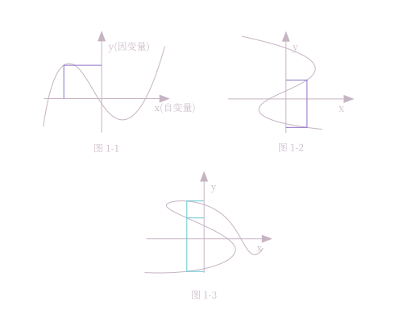
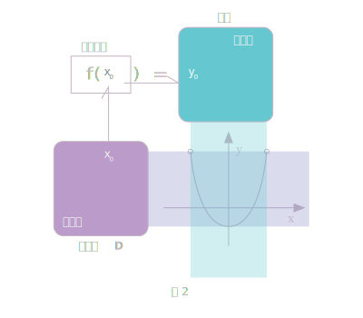
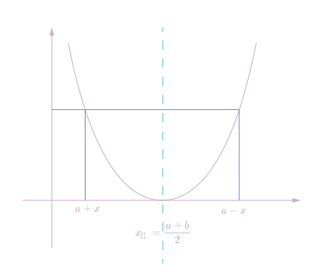
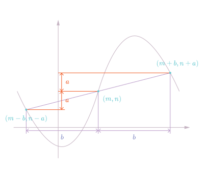

# 函数的概念与基本性质
# 函数的概念

在高中我们用一种新方法来表示函数, 结构如下. 
$$
\underset{函数名}{f}(\underset{自变量}{x})=函数解析式
$$

> [!NOTE] 这样写好处都有啥
> 这样写相较于初中的写法, 这种写法在答题时可以省字, 可以给函数命名而不混淆, 明确了函数解析式中的自变量. 
## 什么是函数

这个问题有一个经典的"黑盒"解释, 即函数是一个可以输入和输出的黑盒. 

将这个"黑盒"抽象一下, 函数由三个过程组成: 
- 输入
- 处理
- 输出
输入的值在处理过后产生输出, 输入和输出之间会有一种关系, 函数就是处理的过程
## 函数、自变量和因变量

> 先定义 $x$ 与 $y$ 两个变量, 然后我们随便为它们确立一个关系, 这就形成了一个函数. 在这里, 对于 $x$ 取的任意值, $y$ 都有对应的**唯一值**与其对应. 这时, 我们称 $y$ 为 $x$ 的**函数** ($x$ 与 $y$ 为函数关系), 其中 $x$ 称为**自变量**,$y$ 称为**因变量**. 

太抽象了, 结合点图像看看吧! 

在 图 1-1 中, 我们取任意一个 $x$ 值, 都有唯一的 $y$ 值与其对应, 我们称 $y$ 为 $x$ 的函数 (而任取任意 y 值则存在有多个对应的 x 值, 所以不能称 x 为 y 的函数), 其中其中 $x$ 称为自变量,$y$ 称为因变量. 

在 图 1-2 中, 虽然取任意一个 $y$ 值存在有一个对应的 $x$ 值, 它不是函数**图像**.

在 图 1-3 中, 怎么取都会存在任取一个值对应多个值, 故它不是函数图像.

自变量(Independent variable, 独立 变量): 可以理解为自己可以独立变换的量. 
因变量(dependent variable, 依赖 变量): 随自变量变得的量. 

> [!NOTE] 垂线测试
> 对于一个函数，每一个 $x$ 值至多对应一个 $y$ 值。因此，对于实函数，一条垂直于x轴的直线$x=k$与一个函数的图像至多有1个交点。如不然，则说明其并非函数的图像。

## 定义域、值域和对应法则

> 设 $\mathbf{D}$ 是一个非空实数集, 对于 $\mathbf{D}$ 中的每一个 $x$, 按照某个对应法则 $f$ , 都有唯一确定的实数 $y$ 与它对应, 则称这个对应关系为集合 $\mathbf{D}$ 上的函数
> $$
y=f(x),x\in\mathbf{D}
$$
> 其中, $x$ 称为函数的自变量, 集合 $\mathbf{D}$ 称为函数的定义域.
> 当 $x_0\in \mathbf{D}$ 时, 与 $x_0$ 相对应的值 $y_0$ 称为函数在点 $x_0$ 处的函数值, 记作 $y_0=f(x_0)$. 函数值的集合 $\{y|y=f(x),x\in \mathbf{D}\}$ 称为函数的值域. 
> ——《数学. 基础模块 上册》高等教育出版社

对应法则: 代表了函数自变量和因变量间的结构. 
定义域: 由全体自变量组成的集合. 
值域: 由全体因变量组成的集合. 

函数三要素: 定义域、对应法则、值域 

> [!NOTE] 题型
> 1. 给定一自变量是代数式的函数, 求自变量为x时的结果
> 	- eg: 已知 $f(x-1)=x^2-2x$ 求 $f(x)$.
> 		注意不要 将 $x-1$ 代入右侧的 $x$ 这就相当于在说 $x-1=x$, 怎么可能? . 

# 函数的基本性质

## 对称性
### 轴对称
若一个函数图像具有对称轴, 则当我们取两个对于该坐标轴对称且 $y$ 坐标值相等的两点时, 这两点的 $x$ 坐标距离对称轴的距离理应相等. 

以上图为例, 我们任意选取这样的两点, 令坐标轴位置为 $a$, 再令两点任意一点到对称轴之间的距离为 $x$, 则有 $f(a+x)=f(a-x)$, 且

> [!NOTE]
> 有时候, 题目可能会出成 $f(a+x)=f(b-x)$, 这种情况可以代入中点公式 $\frac{(x_1+x_2)}{2}$ : 
> $$x_对=\frac{(a+x)+(b-x)}{2}=\frac{a+b}{2}$$

#### 特殊情况: 奇函数

这种情况下, 奇函数满足 $f(-x)=f(x)$ , 该函数图像的对称轴一定在 $y$ 轴上

### 中心对称

$$
f(a+x)+f(b+x)=c
$$

#### 特殊情况: 偶函数
偶函数满足 $f(-x)=-f(x)$ , 该函数的中心对称点位于原点上

## 周期性