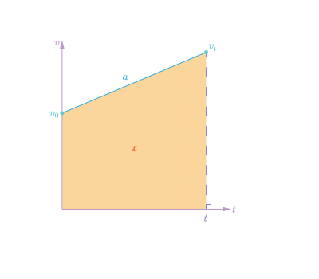

# 匀变速直线运动

公式推导

我们描述直线运动需要三个物理量：位移$x$ 时间$t$ 速度$v$

描述变速则要加上加速度：加速度$a$ 初速度$v_0$ 末速度$v_t$ 

可以将这些使用v-t图像全部描述

在上图中，$a$ 表示线段 $v_0$ $v_t$ ，四边形 $o v_0 v_t t$ 面积代表$x$
接着分析图像：
- 线
$$
v_t=v_0+at
$$
- 面积
$$
x=\frac{(v_0+v_t)t}{2}
$$
$$

$$